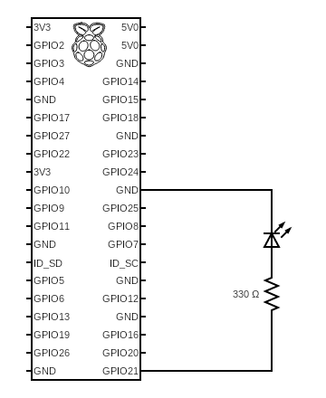

# 01_blinky

## Prep
### Software
Install [`cargo-binutils`](https://github.com/rust-embedded/cargo-binutils). We will use [`rust-objcopy`](https://github.com/rust-embedded/cargo-binutils#objcopy).

```
cargo install cargo-binutils
rustup component add llvm-tools-preview
```

### Wiring


### Micro SD Formatting
To make sure formatting of the microSD card is correct, I recommend using [Raspberry Pi Imager](https://www.raspberrypi.com/software/) to first flash a working OS to the card (I chose 64-bit Raspberry Pi OS Lite but I don't think it matters). Make sure the OS you flashed boots as a sanity check before loading the image we make here.

## Deploy
Copy `kernel8.img` and `config.txt` from this directory and paste it into the microSD card, overwriting the files on there already.

